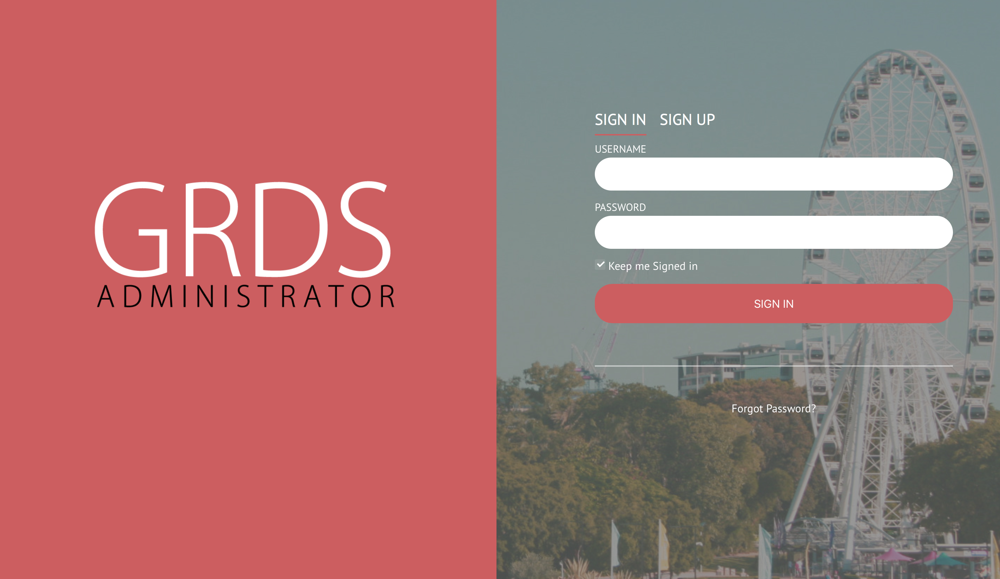
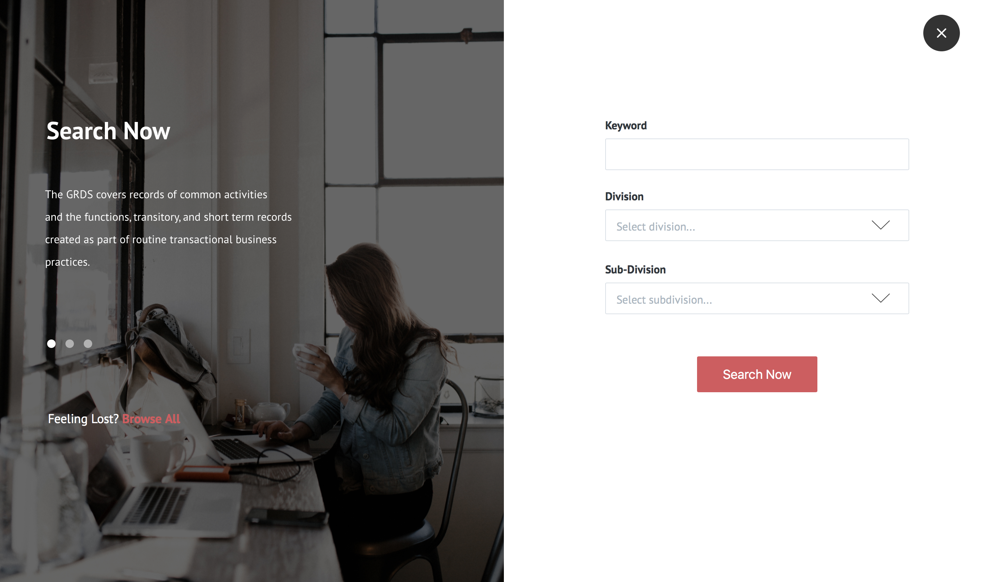
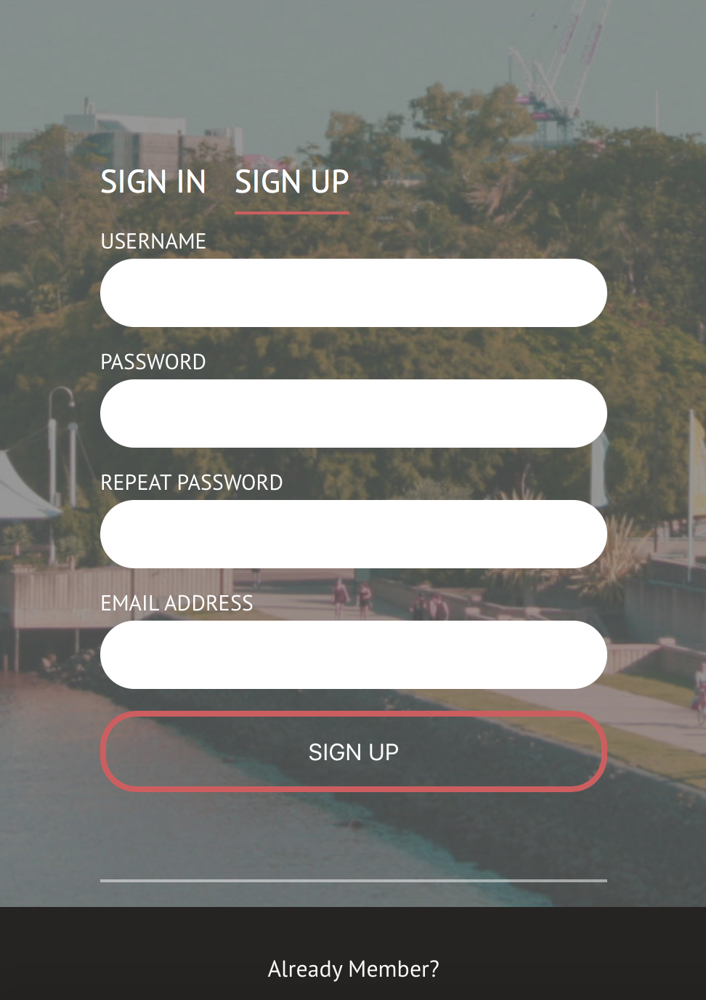
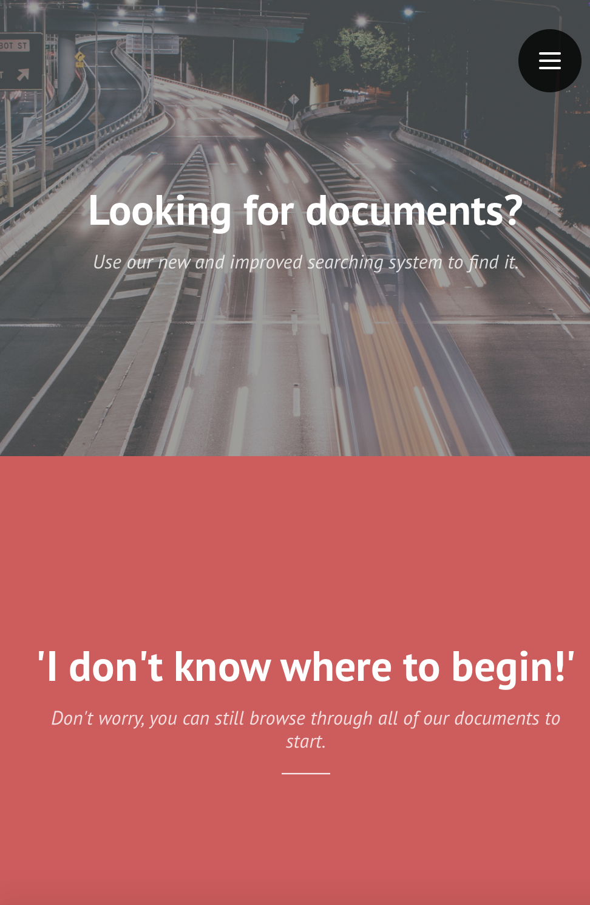

Sliding Panels Template
=========

A simple portfolio template, with project preview images that slide out to reveal the selected project.

[Article on CodyHouse](http://codyhouse.co/gem/sliding-panels-template/)

[Demo](https://codyhouse.co/demo/sliding-panels-template/index.html)
 
[Terms](http://codyhouse.co/terms/)

Images: [Unsplash](https://unsplash.com/)

<b>MODIFICATION FOR GRDS TEMPLATE</b>

The General Retention and Disposal Schedule (GRDS) is owned by the Queensland  Government. It contains a collection of records of general activities and functions, transitory and short term records created for the purpose of periodic transactional business practices. The content of the document would aid the general public who are willing to create a new business or could benefit a business by referring to the past records in the GRDS website. These records maybe in a form of word processing systems, database systems, or from devices such as security cameras, drones etc. Being a periodically modified documents, the administrator must  update the content every certain amount of time, the administrator are to manage whether or not the records should be kept for a long term or only for a short time to show a history for the future generations.

As of now the document is available for the public but has limited action for them, the way that the document is arranged also makes it difficult and time consuming for the authorized personnel to access and update the records. The current system only provides a pdf files that would potentially be difficult for the public to navigate through, as there are no system that would gamify the act of searching through the document. 

Our clients has presented us the criteria that was needed for the website that will aid the QSA make a full use of the GRDS documents. They are in charge of managing the archives in the GRDS documents, hence are able to provide us examples of what the essential purpose of the website is. During the process of making the website, we have regular fortnightly meetings with the clients to understand their needs and expectation of the project.

The whole website has two general purposes, one part is solely for the administrator, they would have an assigned username and password because they are the one that is enabled to have a access to modify and delete any part of the content of the GRDS. The other part which is the left part of the homepage is for public use, where when the user clicks on it, they will be taken into a search engine with a section and subsection dropdown menu, as well as keyword text box.
<i>
The project aim for a responsive and request from client to stay away from 'governmental-styled' website. As a front-end developer in the team, I was responsible for the development on login and search ux. The following screenshots are the final visual of website:</i>

LOGIN PAGE

<i>MOBILE PREVIEW</i>

